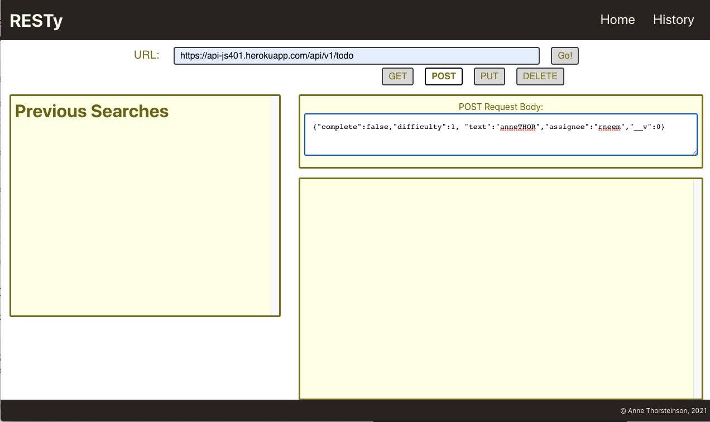
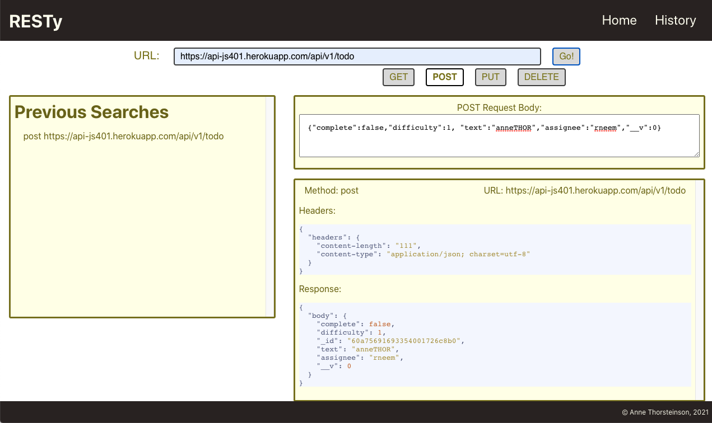

# RESTy

RESTy is a web app that makes HTTP calls to an input url and then displays the response in pretty printed JSON in the right hand display window. RESTy also catalogs a list of previously listed sites (with the corresponding method) and users can click these to preload the URL field. The History Tab also contains a list format of the previous (unique) calls made to the RESTy system.

[Live Version @ Github Pages](https://annethor.github.io/RESTy/)

## Functionality at Phase 2

To install the project, clone the repository locally and run ```npm i``` to install the necessary packages.

```npm start``` will load the development version front end of the project.

Users can enter a URL and the HTTP method they desire by clicking the associated radio button.

When the user clicks the "Go" button, their selected method and URL entered will appear below in the display area.

"get" is the default HTTP method selected, functionality is now added to make the get request and display the response headers, body, and count (if count is applicable to the data being returned).

Here is an example result:


`POST`, `PUT` and `DELETE` methods are now all fully functional, but require correct inputs from the user.

For example, for a user to successfully send the body for a `POST` or `PUT` option, they will need to enter an object with properly formatted inputs into the input dialog (which only appears when the PUT and POST methods are selected). Please see a relevant example below:





And OF COURSE, there is now a spinner, that you may catch a glimpse of if your API is taking a particularly long time to load!

## UML Diagram of Current Working System


## Development History

[Overview at Phase Two](./assets/PhaseTwo.md)

[Overview at Phase One](./assets/PhaseOne.md)
