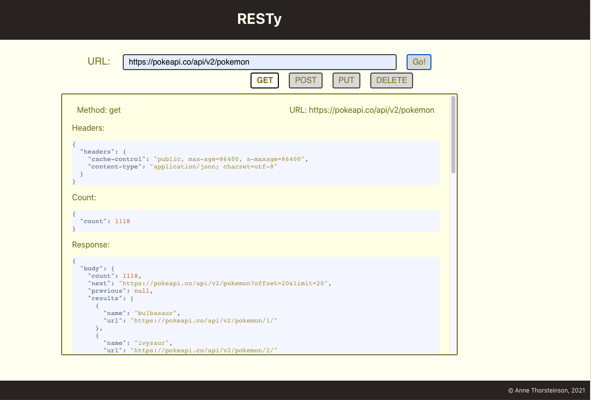
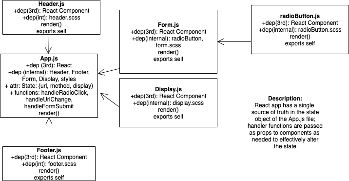

# RESTy

RESTy is a web app that will eventually analyze HTTP requests as they are sent to the URL entered by the user and will return a well formatted analysis of the response in the display area.

[Live Version @ Github Pages](https://annethor.github.io/RESTy/)

## Functionality at Phase 2

To install the project, clone the repository locally and run ```npm i``` to install the necessary packages.

```npm start``` will load the development version front end of the project.

Users can enter a URL and the HTTP method they desire by clicking the associated radio button.

When the user clicks the "Go" button, their selected method and URL entered will appear below in the display area.

"get" is the default HTTP method selected, functionality is now added to make the get request and display the response headers, body, and count (if count is applicable to the data being returned). Here is an example result:



## UML Diagram of Current Working System


